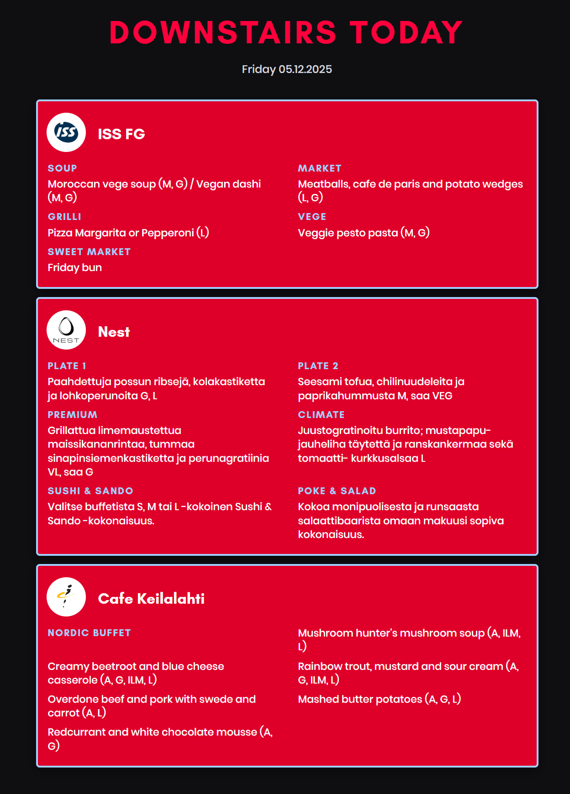

# Keilamenu

A simple Flask web app that displays today's lunch menus from three restaurants in the Keilaniemi area.



## Restaurants

- **ISS FG** - Scraped from [fg.ravintolapalvelut.iss.fi](https://fg.ravintolapalvelut.iss.fi/)
- **Nest** - Scraped from [nest-restaurant.fi](https://www.nest-restaurant.fi/)
- **Cafe Keilalahti** (Compass Group) - Scraped from Compass Group RSS feed

## Tech Stack

- Python / Flask
- BeautifulSoup for web scraping
- Gunicorn for production
- Azure App Service + GitHub Actions for deployment

## Local Development

```bash
# Clone
git clone https://github.com/Jinssi/Keilamenu.git
cd Keilamenu

# Setup
python -m venv venv
source venv/bin/activate  # Windows: venv\Scripts\activate
pip install -r requirements.txt

# Run
python app.py
```

Open http://localhost:5000

## Deployment

Deployed automatically to Azure App Service via GitHub Actions on push to `main`.

Live at: https://keilamenuu.azurewebsites.net

## License

[CC0 1.0 Universal](LICENSE) - Public Domain
